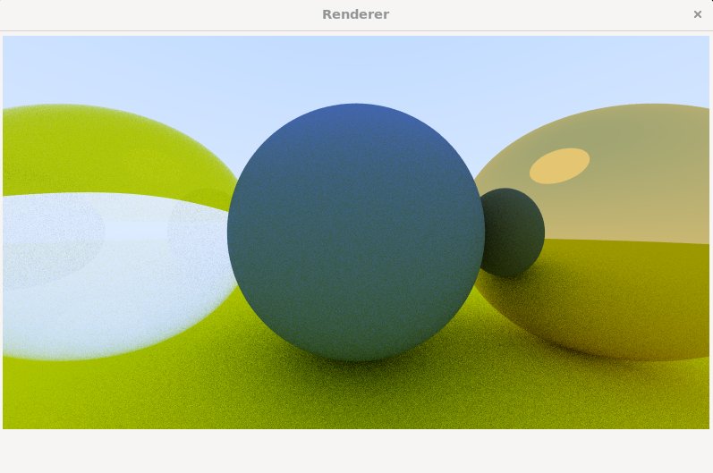

# RTinOW
Python reiteration of "Ray Tracing in One Weekend"

<p align="center" float="left">
  
</p>

## Quick setup guide
Tested with Python 3.10.9. Project requires wxPython, numpy, tqdm.

```bash
python3 Application.py
```